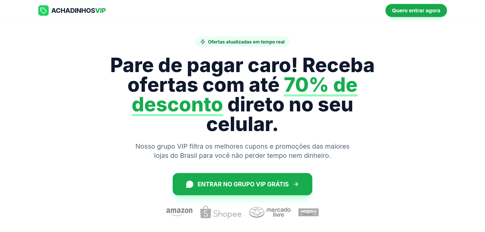

# Achadinhos e Promos Landing Page Template

<div align="center">

</div>


## V1 created using AI Studio

## Run and deploy

This contains everything you need to run your app locally.

### Run Locally

**Prerequisites:**  Node.js

1. Install dependencies:
   `npm install`
2. Copy the `.env.example` file to `.env`
3. Set the env entris in `.env`
```sh
VITE_API_BASE_URL=
VITE_MAIN_GROUP_LINK=
```
4. Run the app:
```sh
npm run dev
```
